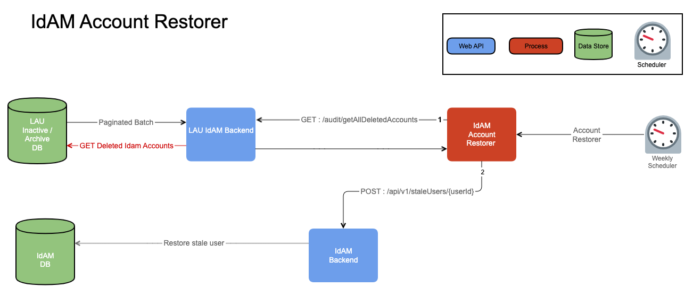
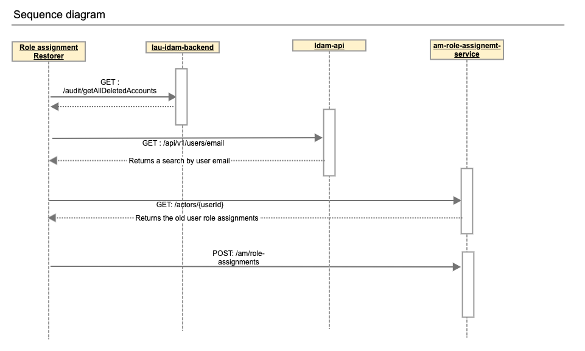

# Idam user disposer

## Purpose

This micro-service runs periodically and disposes archived citizen accounts 

## Extra functionality

Available on tag
[v2.0.0](https://github.com/hmcts/disposer-idam-user/releases/tag/v2.0.0) and
also as a separate
[read-only branch](https://github.com/hmcts/disposer-idam-user/tree/release/user-restorer-role-merger).

Role-assignments returns paged results, however we overlooked this and
disposer-idam-user deleted a lot more users than had to. This caused us to
write additional functionality to restore all the users, which we don't expect
to use in the future. But if ever need to, there are few things required
outside of our app control. This is an attempt to document those requirements.

Additional functionality is:
* idam user restorer. Used to restore deleted users. Flow roughly looks like
this:
  * get deleted users from lau-idam-backend DB table in batches
  * iterate over deleted entries individually and create a request
  * call idam api to insert the user
  * check the response for any potential conflicts due to user already present
  on idam



* role assignments merger. If there were conflicts due to user already existing
on idam we needed to merge old user id with a new user id. Flow roughly looks
like this:
  * get deleted users from lau-idam-backend DB table in batches
  * query idam for the user using email address
  * check if there are multiple IDs for the same user for the same email
  * on multiple IDs get role assignments for deleted user from role assignments
  * create role assignments request using new user (active) id and assigning
  old user (deleted/archived) role assignments to the new user



For role assignments to work we need:

* `search-user` scope in `[idam-access-config](https://github.com/hmcts/idam-access-config)`.
Revert PR [is here](https://github.com/hmcts/idam-access-config/pull/596)

and we need to add environment variables in
[cnp-flux-config](https://github.com/hmcts/cnp-flux-config/pull/30384/files) for all
environments:

```yaml
IDAM_USER_RESTORER_ENABLED: false
DISPOSER_RESTORER_BATCH_SIZE: 100
DISPOSER_RESTORER_REQUESTS_LIMIT: 10000
DISPOSER_RESTORER_START_PAGE: 1
IDAM_DUPLICATE_USER_RESTORER_ENABLED: false
DUPLICATE_USER_MERGE_DRY_RUN: true
DUPLICATE_USER_BATCH_SIZE: 100
DUPLICATE_USER_REQUESTS_LIMIT: 10000
DUPLICATE_USER_START_PAGE: 1
```

We disabled some functional tests in order for pipeline to pass, as permission
was already removed.

## Getting started

### Prerequisites
- [JDK 21](https://openjdk.org/projects/jdk/21/)

### Building the application

The project uses [Gradle](https://gradle.org/) as a build tool. It already
contains `gradlew` wrapper script, so there's no need to install system-wide
gradle.

To build the project execute the following command:

```bash
./gradlew build
```

### Running the application

Create the image of the application by executing the following command:

```bash
  ./gradlew assemble
```

Create docker image:

```bash
  docker-compose build
```

Run the distribution by executing the following command:

```bash
  docker-compose up
```

This will start the container and by default exits immediately as service is
set to disabled. If service were enabled, then it would try to fetch stale
(archived) users from idam-api, filter by roles querying (am-role-assignments)
and call user deletion endpoint on idam-api.

### Alternative script to run application

To skip all the setting up and building, just execute the following command:

```bash
./bin/run-in-docker.sh
```

For more information:

```bash
./bin/run-in-docker.sh -h
```

Script includes bare minimum environment variables necessary to start api
instance. Whenever any variable is changed or any other script regarding docker
image/container build, the suggested way to ensure all is cleaned up properly
is by this command:

```bash
docker-compose rm
```

It clears stopped containers correctly. Might consider removing clutter of
images too, especially the ones fiddled with:

```bash
docker images

docker image rm <image-id>
```

There is no need to remove postgres and java or similar core images.

## Developing

### Unit tests
To run all unit tests execute the following command:
```bash
./gradlew test
```

### Integration tests
To run all integration tests execute the following command:
```bash
./gradlew integration
```

### Functional tests
Functional tests require setting the right environment variables pointing to
idam-api and am-role-assignemnt services. To access those services, VPN needs
to be connected. To get secret and password refer to disposer key-vault. Once
everything is setup, functional tests can be executed using the following
command:

```bash
./gradlew functional
```

### Code quality checks
We use [checkstyle](http://checkstyle.sourceforge.net/) and [PMD](https://pmd.github.io/).

To run all checks execute the following command:

```bash
./gradlew clean checkstyleMain checkstyleTest checkstyleIntegrationTest pmdMain pmdTest pmdIntegrationTest
```

or to generate a code coverage report execute the following command:

```bash
./gradlew integration functional jacocoTestReport
```

## License

This project is licensed under the MIT License - see the [LICENSE](LICENSE) file for details
